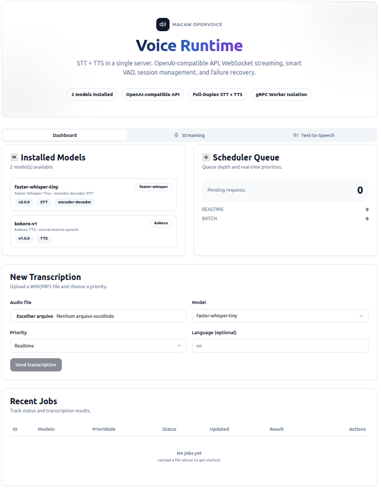

<p align="center">
  
</p>

<h1 align="center">Macaw OpenVoice</h1>

<p align="center">
  <strong>Voice runtime (STT + TTS) with OpenAI-compatible API</strong>
</p>

<p align="center">
  <a href="https://github.com/useMacaw/macaw-openvoice/releases"></a>
  <a href="LICENSE"></a>
  <a href="https://www.python.org/downloads/"></a>
  <a href="https://github.com/useMacaw/macaw-openvoice/actions"></a>
  <a href="https://pypi.org/project/macaw-openvoice/"></a>
</p>

<p align="center">
  <a href="#quick-start">Quick Start</a> &middot;
  <a href="#core-capabilities">Core Capabilities</a> &middot;
  <a href="#architecture">Architecture</a> &middot;
  <a href="#api-compatibility">API Docs</a> &middot;
  <a href="#demo">Demo</a> &middot;
  <a href="https://usemacaw.github.io/macaw-openvoice">Full Documentation</a>
</p>

---

**Production Voice Runtime Infrastructure**
Real-time Speech-to-Text and Text-to-Speech with OpenAI-compatible API, streaming session control, and extensible execution architecture.


## Overview

**Macaw OpenVoice is a production-grade runtime for voice systems.**

It standardizes and operationalizes the execution of Speech-to-Text (STT) and Text-to-Speech (TTS) models in real environments by providing:

* a unified execution interface for multiple inference engines
* real-time audio streaming with controlled latency
* continuous session management
* bidirectional speech interaction
* operational observability
* production-ready APIs

Macaw acts as the **infrastructure layer between voice models and production applications**, abstracting complexity related to streaming, synchronization, state management, and execution control.


## Technology Positioning

Macaw OpenVoice plays the same role for voice systems that:

* **vLLM** plays for LLM serving
* **Triton Inference Server** plays for GPU inference
* **Ollama** plays for local model execution

It transforms voice models into operational services.

---

## Core Capabilities

### Unified Interface

* OpenAI-compatible Audio API
* Real-time full-duplex WebSocket streaming
* Local runtime CLI

### Bidirectional Speech Streaming

* simultaneous STT and TTS in the same session
* automatic speech detection
* barge-in support (interruptible speech)
* automatic mute during synthesis

### Session Management

* state machine for continuous audio processing
* ring buffer with persistence
* crash recovery without context loss
* cross-segment coherence

### Audio Processing Pipeline

* automatic resampling
* DC offset removal
* gain normalization
* voice activity detection

### Multi-Engine Execution

* multiple STT and TTS engines
* subprocess isolation
* declarative model registry
* pluggable architecture

### Operational Control

* priority-based scheduler
* dynamic batching
* latency tracking
* Prometheus metrics

---

## Production Use Cases

Macaw is designed for real-world voice workloads:

* real-time conversational voice agents
* telephony automation (SIP / VoIP)
* live transcription systems
* embedded voice interfaces
* multimodal assistants
* interactive media streaming
* continuous audio processing pipelines

---

## Quick Start

```bash
# Install
pip install macaw-openvoice[server,grpc,faster-whisper]

# Pull a model
macaw pull faster-whisper-tiny

# Start the runtime
macaw serve
```

```
$ macaw serve
  ╔══════════════════════════════════════════════╗
  ║         Macaw OpenVoice v1.0.0              ║
  ╚══════════════════════════════════════════════╝

INFO     Scanning models in ~/.macaw/models
INFO     Found 2 model(s): faster-whisper-tiny (STT), kokoro-v1 (TTS)
INFO     Spawning STT worker   faster-whisper-tiny  port=50051  engine=faster-whisper
INFO     Spawning TTS worker   kokoro-v1            port=50052  engine=kokoro
INFO     Scheduler started     aging=30.0s  batch_ms=75.0  batch_max=8
INFO     Uvicorn running on http://127.0.0.1:8000
```

### Transcribe a file

```bash
# Via REST API
curl -X POST http://localhost:8000/v1/audio/transcriptions \
  -F file=@audio.wav \
  -F model=faster-whisper-tiny

# Via CLI
macaw transcribe audio.wav --model faster-whisper-tiny
```

### Streaming via WebSocket

```bash
wscat -c "ws://localhost:8000/v1/realtime?model=faster-whisper-tiny"
# Send binary audio frames, receive JSON transcript events
```

### Text-to-Speech

```bash
curl -X POST http://localhost:8000/v1/audio/speech \
  -H "Content-Type: application/json" \
  -d '{"model": "kokoro-v1", "input": "Hello, how can I help you?", "voice": "default"}' \
  --output speech.wav
```

## Architecture

```
                         Clients
          CLI / REST / WebSocket (full-duplex)
                           |
                           v
  +----------------------------------------------------+
  |              API Server (FastAPI)                    |
  |                                                    |
  |  POST /v1/audio/transcriptions    (STT batch)      |
  |  POST /v1/audio/translations      (STT translate)  |
  |  POST /v1/audio/speech            (TTS)            |
  |  WS   /v1/realtime                (STT+TTS)        |
  +----------------------------------------------------+
  |              Scheduler                              |
  |  Priority queue (realtime > batch), cancellation,   |
  |  dynamic batching, latency tracking                 |
  +----------------------------------------------------+
  |              Model Registry                         |
  |  Declarative manifest (macaw.yaml), lifecycle        |
  +----------+-------------------+---------------------+
             |                   |
    +--------+--------+  +------+-------+
    |  STT Workers    |  |  TTS Workers |
    |  (subprocess    |  |  (subprocess |
    |   gRPC)         |  |   gRPC)      |
    |                 |  |              |
    | Faster-Whisper  |  | Kokoro       |
    | WeNet           |  |              |
    +-----------------+  +--------------+
             |
  +----------+-------------------------------------+
  |  Audio Preprocessing Pipeline                   |
  |  Resample -> DC Remove -> Gain Normalize        |
  +------------------------------------------------+
  |  Session Manager (STT only)                     |
  |  6 states, ring buffer, WAL, LocalAgreement,    |
  |  cross-segment context, crash recovery          |
  +------------------------------------------------+
  |  VAD (Energy Pre-filter + Silero VAD)           |
  +------------------------------------------------+
  |  Post-Processing (ITN via NeMo)                 |
  +------------------------------------------------+
```

## Demo
<p align="center">
  
</p>


## Supported Models

| Engine | Type | Architecture | Partials | Hot Words | Status |
|--------|------|-------------|----------|-----------|--------|
| [Faster-Whisper](https://github.com/SYSTRAN/faster-whisper) | STT | encoder-decoder | LocalAgreement | via initial_prompt | Supported |
| [WeNet](https://github.com/wenet-e2e/wenet) | STT | CTC | native | native keyword boosting | Supported |
| [Kokoro](https://github.com/hexgrad/kokoro) | TTS | neural | — | — | Supported |

Adding a new engine requires ~400-700 lines of code and zero changes to the runtime core. See the [Adding an Engine](https://usemacaw.github.io/macaw-openvoice/docs/guides/adding-engine) guide.

## API Compatibility

Macaw implements the [OpenAI Audio API](https://platform.openai.com/docs/api-reference/audio) contract, so existing SDKs work without modification:

```python
from openai import OpenAI

client = OpenAI(base_url="http://localhost:8000/v1", api_key="not-needed")

# Transcription
result = client.audio.transcriptions.create(
    model="faster-whisper-tiny",
    file=open("audio.wav", "rb"),
)
print(result.text)

# Text-to-Speech
response = client.audio.speech.create(
    model="kokoro-v1",
    input="Hello, how can I help you?",
    voice="default",
)
response.stream_to_file("output.wav")
```

## WebSocket Protocol

The `/v1/realtime` endpoint supports full-duplex STT + TTS:

```
Client -> Server:
  Binary frames     PCM 16-bit audio (any sample rate)
  session.configure  Configure VAD, language, hot words, TTS model
  tts.speak          Trigger text-to-speech synthesis
  tts.cancel         Cancel active TTS

Server -> Client:
  session.created     Session established
  vad.speech_start    Speech detected
  transcript.partial  Intermediate hypothesis
  transcript.final    Confirmed segment (with ITN)
  vad.speech_end      Speech ended
  tts.speaking_start  TTS started (STT muted)
  Binary frames       TTS audio output
  tts.speaking_end    TTS finished (STT unmuted)
  error               Error with recoverable flag
```

## CLI

```bash
macaw serve                                   # Start API server
macaw transcribe audio.wav                    # Transcribe file
macaw transcribe audio.wav --format srt       # Generate subtitles
macaw transcribe --stream                     # Stream from microphone
macaw translate audio.wav                     # Translate to English
macaw list                                    # List installed models
macaw pull faster-whisper-tiny                # Download a model
macaw inspect faster-whisper-tiny             # Model details
```

## Demo

An interactive demo with a React/Next.js frontend is included:

```bash
./demo/start.sh
```

This starts the FastAPI backend (port 9000) and the Next.js frontend (port 3000) together. The demo includes a dashboard for batch transcriptions, real-time streaming STT with VAD visualization, and a TTS playground. See [demo/README.md](demo/README.md) for details.

## Development

```bash
# Setup (requires Python 3.11+ and uv)
uv venv --python 3.12
uv sync --all-extras

# Development workflow
make check       # format + lint + typecheck
make test-unit   # unit tests (preferred during development)
make test        # all tests (1686 passing)
make ci          # full pipeline: format + lint + typecheck + test
```

## Documentation

Full documentation is available at **[usemacaw.github.io/macaw-openvoice](https://usemacaw.github.io/macaw-openvoice)**.

- [Getting Started](https://usemacaw.github.io/macaw-openvoice/docs/getting-started/installation)
- [Streaming Guide](https://usemacaw.github.io/macaw-openvoice/docs/guides/streaming-stt)
- [Full-Duplex Guide](https://usemacaw.github.io/macaw-openvoice/docs/guides/full-duplex)
- [Adding an Engine](https://usemacaw.github.io/macaw-openvoice/docs/guides/adding-engine)
- [API Reference](https://usemacaw.github.io/macaw-openvoice/docs/api-reference/rest-api)
- [Architecture](https://usemacaw.github.io/macaw-openvoice/docs/architecture/overview)

## Contributing

We welcome contributions! Please read our [Contributing Guide](CONTRIBUTING.md) before submitting a pull request.

## Contact

- **Website:** [usemacaw.io](https://usemacaw.io)
- **Email:** [hello@usemacaw.io](mailto:hello@usemacaw.io)
- **GitHub:** [github.com/usemacaw/macaw-openvoice](https://github.com/usemacaw/macaw-openvoice)

## License

[Apache License 2.0](LICENSE)
